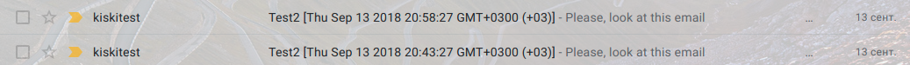
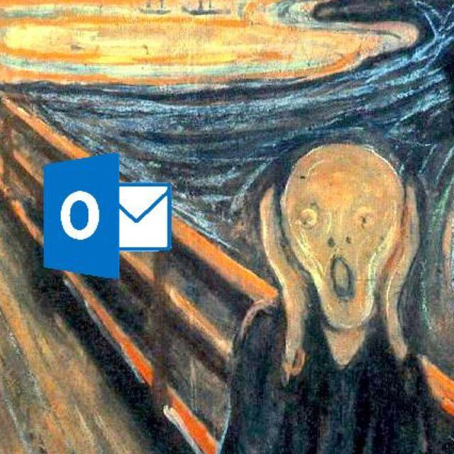

# Email

## Основные моменты, которые необходимо знать
### 1. Background
Если вы хотите использовать background в письмах, то необходимо задать его тегу `<table>`.
**Важно!!! В других тегах это свойство работать не будет.**
```html
<table cellpadding="0" style="margin: 0; padding: 0; background: #000000">
    <tr>
        <td style="margin: 0; padding: 0">Nice</td>
    </tr>
</table>
```
### 2. Отступы
У тега `<tr>` нет марджинов и паддингов. Тегу обычно не задают стили, если вы их видите в коде, вероятно, что это просто была неправильная сборка. Это не критично, но давайте писать правильный код (для писем ;))


Чтобы выровнять текст в разных ячейках можно использовать несколько способов: 
 * использование атрибутов для объединения ячек, строк `collspan, rowspan`;
 ```html
/*Здесь должен быть пример и гифка*/
```
  * большая степень вложенности таблиц;
    ```html
      <table border="0" cellpadding="0">
          <tr>
              <td>
                  <table border="0" cellpadding="0">
                      <tr>
       
                          <!--[if !mso]><!-->
                          <td></td>
                          <!--<![endif]-->
                          <!--[if mso]>
                          <td height="40"></td>
                          <![endif]-->
                      </tr>
                  </table>
              </td>
              <td>
                  <table border="0" cellpadding="0">
                      <tr>
                          <td class="search-salons">НАЙТИ БЛИЖАЙШИХ МАГАЗИН</td>
                      </tr>
                  </table>
              </td>
          </tr>
      </table>
    ```
    Таким способом мы можем выровнять изображение и текст.
    
  * использовать свойство `vertical-align`:
  ```html
     <td valign="top">
       <table class="services__container">
          <tr>
            <td class="services__images">
                <table>
                    <tr>
                        <td align="center" height="50"></td>
                    </tr>
                    <tr>
                        <td class="services__title">Доставка</td>
                    </tr>
                    <tr>
                        <td class="services__description">Бесплатная доставка</td>
                    </tr>
                    <tr>
                        <td class="services__description">от 4000 руб.</td>
                    </tr>
                </table>
            </td>
            <td class="services__images">
                <table>
                    <tr>
                        <td align="center" height="50"></td>
                    </tr>
                   <tr>
                       <td class="services__title">Пробники</td>
                   </tr>
                   <tr>
                       <td class="services__description">До 5 пробников в подарок</td>
                   </tr>
                </table>
            </td>
          </tr>
       </table>
     </td>
   ```

Получается тоже самое, что и в примере выше. Но если вам нужно будет отодвинуть какой-либо блок, то придется немного подумать, чтобы передвинулся этот блок. Таким образом мы придем снова к вложености.

`padding: 0`, `marging: 0` и `border-spacing: 0` должен стоять у всех `<td>` и `<table>`,  чтобы не было левых отступов.

Для отступов можно использовать гифку с одним прозрачным пикселем, который нужно вставлять как картинку и растягивать, как вам необходимо:
```html
 <tr>
    <td class="spacer">
        
    </td>
  </tr>
```

### 3. Теги
Верстать можно только при помощи этих тегов:  `<span>, <a>, , <table>, <tr>, <td>` (для того чтобы было меньше багов в различных почтовых клиентах 💩)

Теги прошлых лет, которые уже не используют, здесь необходимы:`<br>, <hr>, <b>, <i>`

### 4. Картинки и размеры 
В теге `img` необходимо указывать атрибут `alt`. Поскольку некоторые люди выключают прогрузку картинок для экономии трафика, но они в любом случае должны знать, что изображено(если это несет какой-то смысл).

Обычно картинки находяться внутри ссылки.

Ширина блока у писем 320px - min, 600px - max ширина. Это связанно с тем, что большинство клиентов просматривают почту с телефонов и нет необходимости в больших размерах(это как минимум, как максимум бредово делать огромные письма).

Для адаптивности нужно задавать max-width. Но не во всех почтовых клиентах это работает, так что необходимо указывать и width(здесь должна быть ссылка поэтому поводу вообще, поскольку это не только используется в письмах)

### 5. Прехедер
Для того чтобы ваше письмо выглядело красиво и имела связанный текст вначале получение, необходимо создавать невидимый блок. В котором будет нужная информация, но не всегда этот текст является достаточно большим, чтобы не отражать ненужную информацию. Для этого используют специальный пробел:
```html
<span class="preheader">Please, look at this email</span>
<span class="preheader">&nbsp;&zwnj;&nbsp;&zwnj;&nbsp;&zwnj;&nbsp;&zwnj;&nbsp;&zwnj;&nbsp;&zwnj;&nbsp;&zwnj;&nbsp;&zwnj;&nbsp;&zwnj;&nbsp;&zwnj;&nbsp;&zwnj;&nbsp;&zwnj;&nbsp;&zwnj;&nbsp;
&nbsp;&zwnj;&nbsp;&zwnj;&nbsp;&zwnj;&nbsp;&zwnj;&nbsp;&zwnj;&nbsp;&zwnj;&nbsp;&zwnj;&nbsp;&zwnj;&nbsp;&zwnj;&nbsp;&zwnj;&nbsp;&zwnj;&nbsp;&zwnj;&nbsp;&zwnj;&nbsp;
    &nbsp;&zwnj;&nbsp;&zwnj;&nbsp;&zwnj;&nbsp;&zwnj;&nbsp;&zwnj;&nbsp;&zwnj;&nbsp;&zwnj;&nbsp;&zwnj;&nbsp;&zwnj;&nbsp;&zwnj;&nbsp;&zwnj;&nbsp;&zwnj;&nbsp;&zwnj;&nbsp;
    &nbsp;&zwnj;&nbsp;&zwnj;&nbsp;&zwnj;&nbsp;&zwnj;&nbsp;&zwnj;&nbsp;&zwnj;&nbsp;&zwnj;&nbsp;&zwnj;&nbsp;&zwnj;&nbsp;&zwnj;&nbsp;&zwnj;&nbsp;&zwnj;&nbsp;&zwnj;&nbsp;
    &nbsp;&zwnj;&nbsp;&zwnj;&nbsp;&zwnj;&nbsp;&zwnj;&nbsp;&zwnj;&nbsp;&zwnj;&nbsp;&zwnj;&nbsp;&zwnj;&nbsp;&zwnj;&nbsp;&zwnj;&nbsp;&zwnj;&nbsp;&zwnj;&nbsp;&zwnj;&nbsp;
    &nbsp;&zwnj;&nbsp;&zwnj;&nbsp;&zwnj;&nbsp;&zwnj;&nbsp;&zwnj;&nbsp;&zwnj;&nbsp;&zwnj;&nbsp;&zwnj;&nbsp;&zwnj;&nbsp;&zwnj;&nbsp;&zwnj;&nbsp;&zwnj;&nbsp;&zwnj;&nbsp;
    &nbsp;&zwnj;&nbsp;&zwnj;&nbsp;&zwnj;&nbsp;&zwnj;&nbsp;&zwnj;&nbsp;&zwnj;&nbsp;&zwnj;&nbsp;&zwnj;&nbsp;&zwnj;&nbsp;&zwnj;&nbsp;&zwnj;&nbsp;&zwnj;&nbsp;&zwnj;&nbsp;
    &nbsp;&zwnj;&nbsp;&zwnj;&nbsp;&zwnj;&nbsp;&zwnj;&nbsp;&zwnj;&nbsp;&zwnj;&nbsp;&zwnj;&nbsp;&zwnj;&nbsp;&zwnj;&nbsp;&zwnj;&nbsp;&zwnj;&nbsp;&zwnj;&nbsp;&zwnj;&nbsp;
</span>
```

**Пример:**


### 6. Шрифты
Список шрифтов которые можно использовать:

```css
font-family: Arial, Helvetica, sans-serif;
font-family: 'Arial Black', Gadget, sans-serif;
font-family: Georgia, serif;
font-family: 'MS Sans Serif', Geneva, sans-serif;
font-family: 'MS Serif', 'New York', sans-serif;
font-family: Tahoma, Geneva, sans-serif;
font-family: 'Times New Roman', Times, serif;
font-family: 'Trebuchet MS', Helvetica, sans-serif;
font-family: Verdana, Geneva, sans-serif;
```

## Outlook best of the best of the best


> **Станислав Рева** Outlook - this's my life

### Болезненные моменты Outlook
В outlook необходимо задавать фиксированные размеры (высоту, ширину), иначе контент будет растягиваться. Причем размер задается для ячейки и контента внутри ячейки.

`<thead>`,`<tfoot>` в outlook и mail таких тегов нет, следует выкинуть их из верстки. 

Для написания оптимального кода используются условные комментарии:
```html
 <!--[if !mso]><!-->
    <table border="0" cellpadding="0" cellspacing="0" width="100%" class="email">
    <!--<![endif]-->
    <!--[if mso]>
    <table border="0" cellpadding="0" cellspacing="0" width="600" class="email" align="center" style="margin: 0 auto">
    <![endif]-->
```
Каждый почтовый клиент выбирает свое условие. Если же использовать одиночное условие, то верстка должна выглядеть иначе:
```html
  <!--[if (gte mso 9)|(IE)]>
            <table width="640" style="border-spacing:0; margin: 0; padding: 0;" >
                <tr>
                    <td width="640" valign="top" style="padding:0;" >
            <![endif]-->
```

Для того чтобы выровнять письмо по центру, главной таблице необходимо указать атрибут `align="center"`.
## Полезные ссылки

#### Обязательно к прочтению 
* [Верстка email для чайников](https://habr.com/post/252279/ "Великий НАБР")
* [Вёрстка адаптивных email-писем](https://habr.com/company/pechkin/blog/256853/ "Великий НАБР")
* [Странный пробел](https://litmus.com/blog/the-little-known-preview-text-hack-you-may-want-to-use-in-every-email "Омагад JIitmus")
* [Сборка для писем](https://непалю.покачто "💩")

#### Остальные полезные ссылки
* [Курс по адаптивной верстке писем](https://netology.ru/courses/adaptivnaya-verstka-email "Омагад JIitmus")
* [Интерактивные email](https://litmus.com/blog/interactive-email-for-beginners-6-interactive-elements-you-can-add-to-your-emails-today "Ониме")
