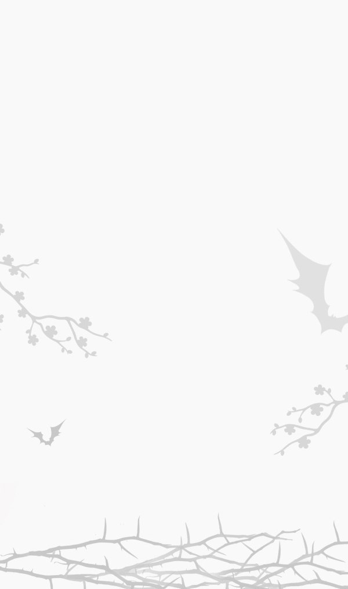
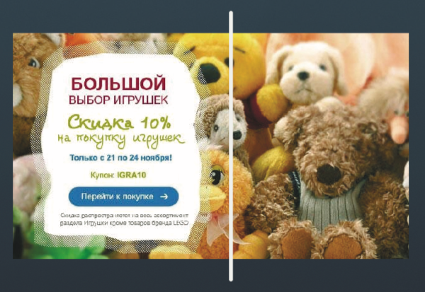

# Рекомендации для дизайнеров

## Основные моменты

Все письма верстают шириной 600px. Из этого следует:
- Картинки(продукты,кнопки) в 2 раза больше исходников;
- Баннеры и фоновые изображения необходимо делать 1200px; 
- Если фоновое изображение имеет какие-то фигуры, то лучше всего их располагать снизу. Фоновое изображение делать шириной 600px, поскольку все равно придется исправлять для outlook. 

### Понимание фронтендера
Намного проще сделать макет в 1200px и просто вырезать оттуда все картинки.
C фоном выше, проще когда он в 600px, качество не пострадает за счет таких фигур, а заморочек для фронта меньше.
Поскольку с вероятностью в мильон процентов, он сам будет менять размер.

## Адаптивность
Скрывать блоки на мобиле, не адаптируя их. Использовать фланговую адаптацию: основной контент слева, справа остается место, которое можно скрыть на узких экранах:

## Сделать сложновато
- фоновые изображения, поверх которых должен быть контент
- адаптивный дизайн
