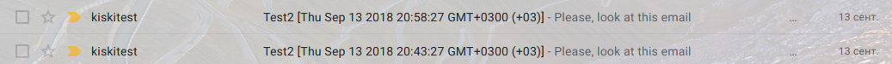
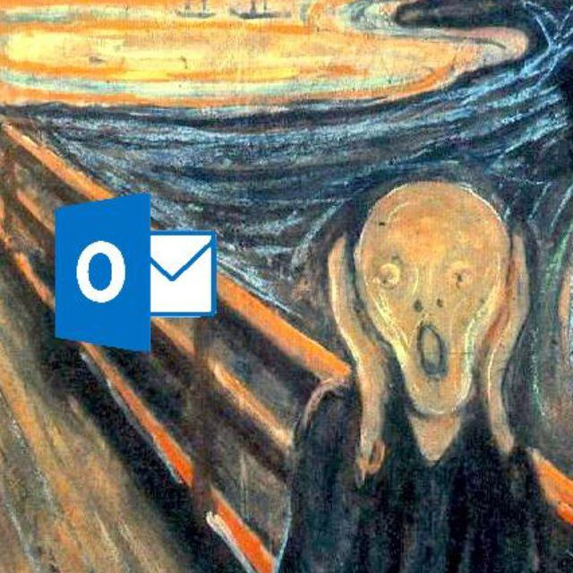
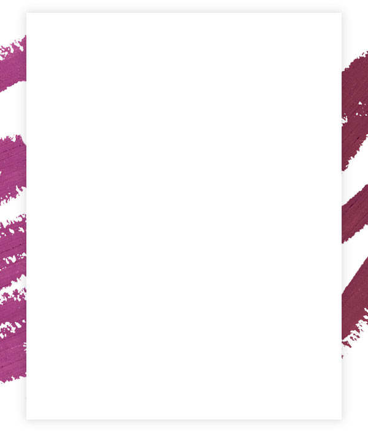
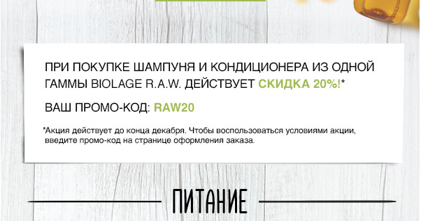
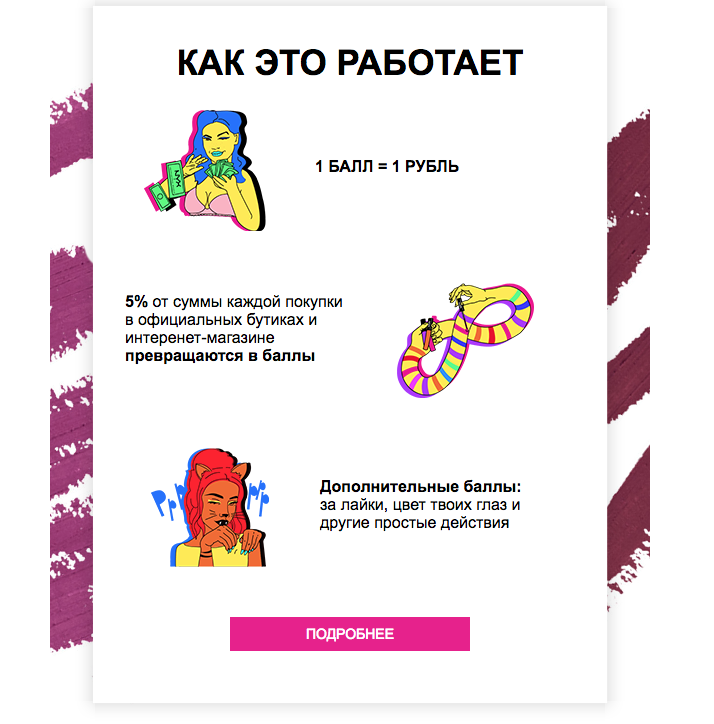
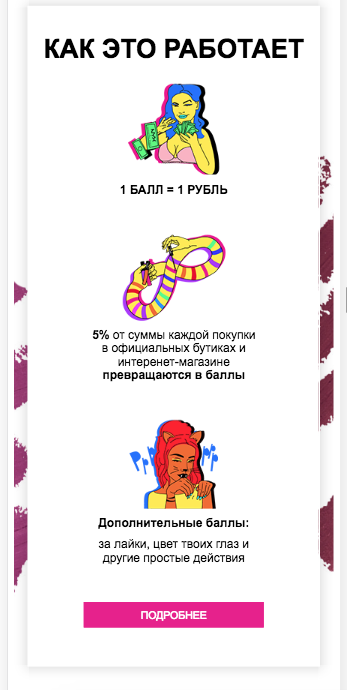
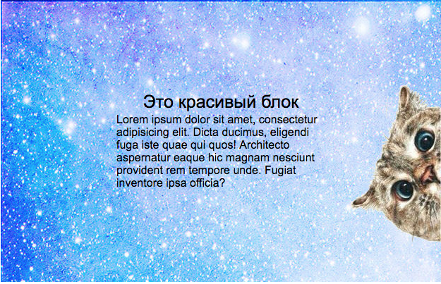
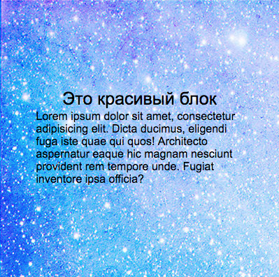

# Верстка писем

## Обязательный код в письме
[Читать тут](https://www.emailonacid.com/blog/article/email-development/which-code-should-i-include-in-every-email/)


## Doctype
Почитать:
- [Which doctype should you use in HTML emails?](https://emails.hteumeuleu.com/which-doctype-should-you-use-in-html-emails-cd323fdb793c)
- [HTML5 vs XHTML 1.0](https://www.campaignmonitor.com/blog/email-marketing/2014/08/html5-vs-xhtml1-the-right-doctype-to-use-in-html-email/)

В основном используется этот:
```html
<!DOCTYPE html PUBLIC "-//W3C//DTD XHTML 1.0 Transitional//EN""http://www.w3.org/TR/xhtml1/DTD/xhtml1-transitional.dtd">
<html lang="en" xmlns="http://www.w3.org/1999/xhtml" xmlns:o="urn:schemas-microsoft-com:office:office">
```

Мета необходимая для iOS 11 и выше. Позволяет расширять картинки и всю блоки с соответсвиями их разрешения
```html
<meta name="x-apple-disable-message-reformatting">
```
## Теги, допустимые в верстке писем
Верстать можно только при помощи этих тегов:  `<span>, <a>, , <table>, <tr>, <td>` (для того чтобы было меньше багов в различных почтовых клиентах 💩)

Теги прошлых лет, которые уже не используют, здесь можно применять:`<br>, <hr>, <b>, <i>`

## Основы табличной верстки
- Использовать `colspan` и  `rowspan` всегда.
- У тега `<tr>` нет маржинов и паддингов. Тегу обычно не задают стили, если вы их видите в коде, вероятно, что это просто была неправильная сборка.

## Основные моменты, которые необходимо знать

### 1. Вертикальное выравнивание
Чтобы выровнять текст относительно картинки в разных ячейках можно использовать несколько способов.

Большая степень вложенности таблиц:

```html
<table border="0" cellpadding="0">
    <tr>
        <td>
            <table border="0" cellpadding="0">
                <tr>
 
                    <!--[if !mso]><!-->
                    <td></td>
                    <!--<![endif]-->
                    <!--[if mso]>
                    <td height="40"></td>
                    <![endif]-->
                </tr>
            </table>
        </td>
        <td>
            <table border="0" cellpadding="0">
                <tr>
                    <td class="search-salons">НАЙТИ БЛИЖАЙШИХ МАГАЗИН</td>
                </tr>
            </table>
        </td>
    </tr>
</table>
```

Таким способом мы можем выровнять изображение и текст.
    
использовать свойство `vertical-align`:

```html
     <td valign="top">
       <table>
          <tr>
            <td>
                <table>
                    <tr>
                        <td align="center" height="50"></td>
                    </tr>
                    <tr>
                        <td>Доставка</td>
                    </tr>
                    <tr>
                        <td>Бесплатная доставка</td>
                    </tr>
                    <tr>
                        <td>от 4000 руб.</td>
                    </tr>
                </table>
            </td>
            <td>
                <table>
                    <tr>
                        <td align="center" height="50"></td>
                    </tr>
                   <tr>
                       <td>Пробники</td>
                   </tr>
                   <tr>
                       <td>До 5 пробников в подарок</td>
                   </tr>
                </table>
            </td>
          </tr>
       </table>
     </td>
```

Получается тоже самое, что и в примере выше. Но если вам нужно будет отодвинуть какой-либо блок, то придется немного подумать, чтобы передвинулся этот блок. Таким образом мы придем снова к вложености.

### 2. Отступы
`padding: 0`, `marging: 0` и `border-spacing: 0` должен стоять у всех `<td>` и `<table>`,  чтобы не было левых отступов.

Для отступов можно использовать гифку с одним прозрачным пикселем(spacer), который нужно вставлять как картинку и растягивать, как вам необходимо:

```html
 <tr>
    <td class="spacer">
        
    </td>
  </tr>
```
Некоторые атлуки не отображают gif, поэтому для правильного использования `spacer.gif` необходимо чтобы одна из величин имела значение в 1px. Либо использовать `spacer.png`

### 3. Background
Если вы хотите использовать background в письмах, то необходимо задать его тегу `<table>`.
**Важно!!! В других тегах это свойство будет работать некорректно.**

```html
<table cellpadding="0" style="margin: 0; padding: 0; background: #000000">
    <tr>
        <td style="margin: 0; padding: 0">Nice</td>
    </tr>
</table>
```


### 4. Картинки и размеры 
В теге `img` необходимо указывать атрибут `alt`. Поскольку некоторые люди выключают прогрузку картинок для экономии трафика, но они в любом случае должны знать, что изображено(если это несет какой-то смысл).

Обычно картинки находяться внутри ссылки.

Ширина блока у писем 320px - min, 600px - max ширина. Это связанно с тем, что большинство клиентов просматривают почту с телефонов и нет необходимости в больших размерах(это как минимум, как максимум бредово делать огромные письма).

Для адаптивности нужно задавать max-width. Но не во всех почтовых клиентах это работает, так что необходимо указывать и width(здесь должна быть ссылка поэтому поводу вообще, поскольку это не только используется в письмах).

`alt` в spacer должен быть пустым.

Если у вас картинки стоят друг под другом, то на андроидах появляеться отступ. Для того чтобы его убрать необходимо картинкам поставить `display: block;`

### 5. Прехедер
Для того чтобы в превью после темы письма не отображалась лишняя информация, необходимо создать невидимый блок(preheader). В котором будет нужная информация, но не всегда этот текст является достаточно большим, чтобы не отражать ненужную информацию. Для этого используют специальный пробел:

```html
<span class="preheader">Please, look at this email</span>
<span class="preheader">&nbsp;&zwnj;&nbsp;&zwnj;&nbsp;&zwnj;&nbsp;&zwnj;&nbsp;&zwnj;&nbsp;&zwnj;&nbsp;&zwnj;&nbsp;&zwnj;&nbsp;&zwnj;&nbsp;&zwnj;&nbsp;&zwnj;&nbsp;&zwnj;&nbsp;&zwnj;&nbsp;
&nbsp;&zwnj;&nbsp;&zwnj;&nbsp;&zwnj;&nbsp;&zwnj;&nbsp;&zwnj;&nbsp;&zwnj;&nbsp;&zwnj;&nbsp;&zwnj;&nbsp;&zwnj;&nbsp;&zwnj;&nbsp;&zwnj;&nbsp;&zwnj;&nbsp;&zwnj;&nbsp;
    &nbsp;&zwnj;&nbsp;&zwnj;&nbsp;&zwnj;&nbsp;&zwnj;&nbsp;&zwnj;&nbsp;&zwnj;&nbsp;&zwnj;&nbsp;&zwnj;&nbsp;&zwnj;&nbsp;&zwnj;&nbsp;&zwnj;&nbsp;&zwnj;&nbsp;&zwnj;&nbsp;
    &nbsp;&zwnj;&nbsp;&zwnj;&nbsp;&zwnj;&nbsp;&zwnj;&nbsp;&zwnj;&nbsp;&zwnj;&nbsp;&zwnj;&nbsp;&zwnj;&nbsp;&zwnj;&nbsp;&zwnj;&nbsp;&zwnj;&nbsp;&zwnj;&nbsp;&zwnj;&nbsp;
    &nbsp;&zwnj;&nbsp;&zwnj;&nbsp;&zwnj;&nbsp;&zwnj;&nbsp;&zwnj;&nbsp;&zwnj;&nbsp;&zwnj;&nbsp;&zwnj;&nbsp;&zwnj;&nbsp;&zwnj;&nbsp;&zwnj;&nbsp;&zwnj;&nbsp;&zwnj;&nbsp;
    &nbsp;&zwnj;&nbsp;&zwnj;&nbsp;&zwnj;&nbsp;&zwnj;&nbsp;&zwnj;&nbsp;&zwnj;&nbsp;&zwnj;&nbsp;&zwnj;&nbsp;&zwnj;&nbsp;&zwnj;&nbsp;&zwnj;&nbsp;&zwnj;&nbsp;&zwnj;&nbsp;
    &nbsp;&zwnj;&nbsp;&zwnj;&nbsp;&zwnj;&nbsp;&zwnj;&nbsp;&zwnj;&nbsp;&zwnj;&nbsp;&zwnj;&nbsp;&zwnj;&nbsp;&zwnj;&nbsp;&zwnj;&nbsp;&zwnj;&nbsp;&zwnj;&nbsp;&zwnj;&nbsp;
    &nbsp;&zwnj;&nbsp;&zwnj;&nbsp;&zwnj;&nbsp;&zwnj;&nbsp;&zwnj;&nbsp;&zwnj;&nbsp;&zwnj;&nbsp;&zwnj;&nbsp;&zwnj;&nbsp;&zwnj;&nbsp;&zwnj;&nbsp;&zwnj;&nbsp;&zwnj;&nbsp;
</span>
```

**Пример:**



### 6. Шрифты
Список шрифтов которые можно использовать:

```css
font-family: Arial, Helvetica, sans-serif;
font-family: 'Arial Black', Gadget, sans-serif;
font-family: Georgia, serif;
font-family: 'MS Sans Serif', Geneva, sans-serif;
font-family: 'MS Serif', 'New York', sans-serif;
font-family: Tahoma, Geneva, sans-serif;
font-family: 'Times New Roman', Times, serif;
font-family: 'Trebuchet MS', Helvetica, sans-serif;
font-family: Verdana, Geneva, sans-serif;
```

## Outlook best of the best of the best


[Mastering Outlook](https://litmus.com/blog/mastering-outlook-a-look-back-at-common-rendering-issues)

### Код для Outlook 2000 и выше
[Тут](https://litmus.com/community/discussions/396-conditional-code-for-outlook) написано подробнее.

Для Outlook всех версий (2000 и выше) работают следующие условные комментарии:

```html
<!--[if (gte mso 9)|(IE)]>
    Код для Outlook всех версий, начиная с 2000.
<![endif]-->

<!--[if !(gte mso 9) & !(IE)]><!-->
    Код для прочих почтовых клиентов.
<!--<![endif]-->
```

Для Outlook 2007 и выше работает такое условие:

```html
<!--[if mso]>
    <td>...</td>
<![endif]-->
```

Для старых версий Outlook (до 2007) сработает такое условие (для версий 2007 и выше оно тоже сработает):

```html
<!--[if (gte mso 9)|(IE)]>
    <td>...</td>
<![endif]-->
```

`mso` значит Microsoft Office. Outlook под MacOS не будет воспринимать эти условия, оно только для Outlook из MS Office.

Код для всех прочих клиентов:

```html
<!--[if !mso]><!-->
    <td>...</td>
<!--<![endif]-->
```

Он не будет работать в Outlook 2007 и выше. Но сработает в более старых версиях Outlook.

- [Conditional comments](https://www.sitepoint.com/internet-explorer-conditional-comments/)

### Болезненные моменты Outlook
В Outlook необходимо задавать фиксированные размеры (высоту, ширину), иначе контент будет растягиваться. Причем размер задается для ячейки и контента внутри ячейки.

`<thead>`, `<tfoot>` в outlook и mail таких тегов нет, следует выкинуть их из верстки. 

Для написания оптимального кода используются условные комментарии:

```html
<!--[if !mso]><!-->
    <table border="0" cellpadding="0" cellspacing="0" width="100%" class="email">
<!--<![endif]-->
<!--[if mso]>
    <table border="0" cellpadding="0" cellspacing="0" width="600" class="email" align="center" style="margin: 0 auto">
<![endif]-->
```
Каждый почтовый клиент выбирает свое условие. Если же использовать одиночное условие, то верстка должна выглядеть иначе:
```html
  <!--[if (gte mso 9)|(IE)]>
            <table width="640" style="border-spacing:0; margin: 0; padding: 0;" >
                <tr>
                    <td width="640" valign="top" style="padding:0;" >
            <![endif]-->
```

Для того чтобы выровнять письмо по центру, главной таблице необходимо указать атрибут `align="center"`.

## Фон в Outlook
Стандартными средствами в Outlook можно указать только цвет фона для таблицы. Для ячеек фон задать нельзя никак начиная с Outlook 2007. Картинки не работают никак.

Однако, можно использовать то, что Outlook понимает VML и сгенерировать фон с помощью http://backgrounds.cm или аналогичных инструментов.

Нужно помнить, что в Outlook 120 DPI (если в Windows установлено увеличение шрифта) рендеринг картинок, размеры которых указаны в пикселях, глючит. И нужно [указывать его в пунктах](http://www.courtneyfantinato.com/correcting-outlook-dpi-scaling-issues/).

Пример:
```html
<td style="background-image:url(https://i.imgur.com/Kdfbz51.png); background-repeat: no-repeat" height="375" width="600" style="height: 375px; width: 600px;" valign="top" align="center">
  <v:image xmlns:v="urn:schemas-microsoft-com:vml" id="theImage"
      style="display: inline-block; position: absolute; width: 450pt; height: 281pt; top: 0; left: 0; border: 0; z-index: 1;"
      src="https://i.imgur.com/Kdfbz51.png"/>
  <v:rect xmlns:v="urn:schemas-microsoft-com:vml" fill="true" stroke="false"
          style="display: inline-block; position: absolute; width: 450pt; height: 281pt; top: 0; left: 0; border: 0; z-index: 2;">
    <v:fill opacity="0%" style="z-index: 1;"/>
    </v:fill>
  </v:rect>
  </td>
```

Также нужно добавить в тег `html` несколько атрибутов и в тег `<head>` кое-какие условия для Outlook. См. ссылки ниже.

- [Пересчет пикселей в пункты](http://www.endmemo.com/sconvert/pixelpoint.php)
- [Solving DPI scaling issues with HTML email in Outlook](https://blog.jmwhite.co.uk/2014/03/28/solving-dpi-scaling-issues-with-html-email-in-outlook/)
- [Fargo email development — walkthrough and my own learning](https://medium.com/@ka.robinson82/https-medium-com-ka-robinson82-fargo-email-6907f00fed16)

### Примеры фонов в Outlook
Текст поверх блока с тенью:


Адаптивности можно добиться, сделав все тени картинками в PNG24. Либо применив `box-shadow`, если наличие тени не критично во всех клиентах.

Для Outlook можно сделать такой фон:



И вставить его по инструкции выше для `td` через VML. Текст разместить в таблице внутри этой ячейки.

См. `nyx-outlook-shadow.html`.

Еще пример, который можно сделать таким же образом:



## Картинки
Картинкам внутри ссылок нужно ставить `border: 0`, чтобы в Outlook 2003 и ниже не было рамок.
Gif в Outlook 2013-16, Mail 10 не работают. Отображается первый кадр из гифки.

## Адаптивность
Стили для адаптивных блоков, которые будут модифицированы через медиа-запросы, нужно писать в теге `<style>`, чтобы их видели только те клиенты, которые понимают медиа-запросы. В остальных случаях будут использованы стили из атрибута `style="..."`.

Стили, которые будут при сборке храниться в теге `<style>` пишутся в отдельном файле (`embed.less`). Если стили переопределяют правила из атрибута `style=""`, то в `embed.less` им нужно указывать `!important`.

### Блочная адаптивность

Адаптивность для мобильных устройств осуществляется засчет флоатов и медиа-запросов.

```css
.description__float {
  float: left;
}
.description__float-right {
  float: right;
}

@media screen and (max-width: 516px) {
  .description__float {
    width: 100% !important;
    padding-left: 0 !important;
    text-align: center;
  }
  .description__content {
    margin: 0 auto !important;
  }
  .description__float-right {
      width: 100%;
      text-align: center !important;
    }
}
```
```html
 <table style="margin: 0; padding: 0; width: 100%;" border="0" cellpadding="0" cellspacing="0">
    <tr>
        <td class="description__float" style="margin: 0; padding: 0;">
            <table class="description__content" style="margin: 0; padding: 0; width: 220px;">
                <tr>
                    <td align="center" style="margin: 0; padding: 0;">
                        <table border="0" cellpadding="0" cellspacing="0" style="margin: 0; padding: 0;">
                            <tr>
                                <td style="margin: 0; padding: 0;"></td>
                            </tr>
                        </table>
                    </td>
                </tr>
            </table>
        </td>
        <td class="description__float" style="margin: 0; padding: 0;">
            <table class="description__content" border="0" cellpadding="0" cellspacing="0" style="margin: 0; padding: 0; width: 220px;">
                <tr>
                    <td class="description__points" style="margin: 0; padding: 0; font-weight: bold; font-size: 16px; padding-top: 50px; font-family: Arial, Helvetica, sans-serif;">1 &#1041;&#1040;&#1051;&#1051; =
                        1 &#1056;&#1059;&#1041;&#1051;&#1068;
                    </td>
                </tr>
            </table>
        </td>
    </tr>
</table>
```

<div style="margin:20px auto">


</div>

### Фланговая адаптивность

Адаптивность для мобильных устройств осуществляется с помощью фиксированной ширины контента и max-width картинки.

```html
<table style="background-image:url(https://i.imgur.com/udyjkwM.jpg); max-width: 624px; width: 100%; height: 400px" align="center">
    <tr>
        <td>
            <table width="300" style="margin: 0 auto">
                <tr>
                    <td align="center"><span style="font-size: 25px;">Это красивый блок</span></td>
                </tr>
                <tr>
                    <td><span>Lorem ipsum dolor sit amet, consectetur adipisicing elit. Dicta ducimus, eligendi fuga iste quae qui quos! Architecto aspernatur eaque hic magnam nesciunt provident rem tempore unde. Fugiat inventore ipsa officia?</span></td>
                </tr>
            </table>
        </td>
    </tr>
</table>
```

<div style="margin:20px auto">


</div>

## Красота
`:hover` понимают некоторые распространенные почтовые клиенты. Эти стили должны храниться в теге `<style>`, поэтому писать их нужно в `embed.less`.

## Полезные ссылки


#### Обязательно к прочтению 
* [Верстка email для чайников](https://habr.com/post/252279/ "Великий НАБР")
* [Вёрстка адаптивных email-писем](https://habr.com/company/pechkin/blog/256853/ "Великий НАБР")
* [Странный пробел](https://litmus.com/blog/the-little-known-preview-text-hack-you-may-want-to-use-in-every-email "Омагад JIitmus")
* [Сборка для писем](https://непалю.покачто "💩")
* [Creating Bulletproof HTML Emails](https://medium.com/tealmedia/creating-bulletproof-html-emails-e0e4866c3f8)

#### Остальные полезные ссылки
* [Курс по адаптивной верстке писем](https://netology.ru/courses/adaptivnaya-verstka-email "Омагад JIitmus")
* [Интерактивные email](https://litmus.com/blog/interactive-email-for-beginners-6-interactive-elements-you-can-add-to-your-emails-today "Ониме")

#### Генерация штук для Outlook от Campaign Monitor
- https://buttons.cm
- http://backgrounds.cm

